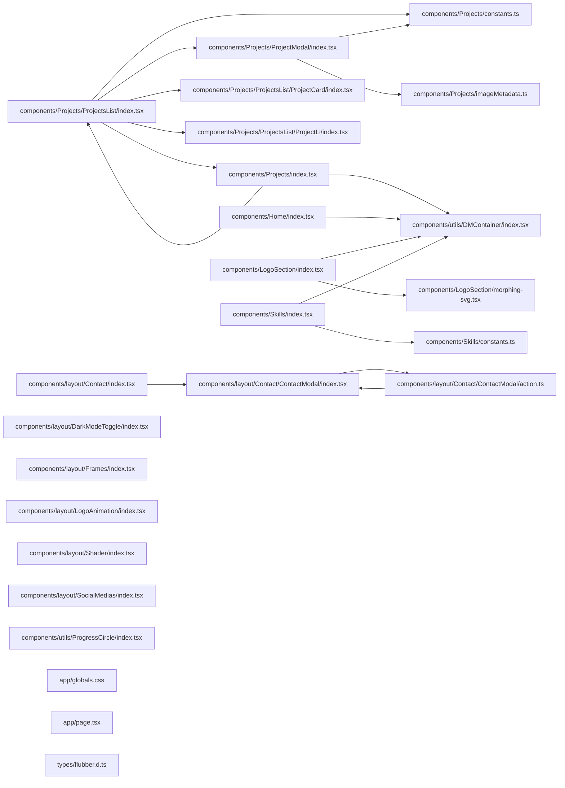

## ARCHITECTURE

A typescript-based project composed of the following subsystems:

- **components/**: Primary subsystem containing 23 files
- **app/**: Primary subsystem containing 3 files
- **hooks/**: Primary subsystem containing 3 files
- **types/**: Primary subsystem containing 1 files
- **libs/**: Primary subsystem containing 1 files

## ENTRY_POINTS

### `components/utils/DMContainer/index.tsx`

```typescript
"use client";

import React from "react";
import { useIsDM } from "@/hooks/useIsDM";

export const DMContainer = ({
  children,
}: Readonly<{
  children: React.ReactNode;
}>) => {
  const isDM = useIsDM();
  return <div className={isDM ? "dark" : ""}>{children}</div>;
};

```

### `components/Projects/ProjectsList/index.tsx`

```typescript
"use client";

import React, { useEffect, useRef, useState } from "react";
import { projectsList } from "../constants";
import { ProjectLi } from "./ProjectLi";
import { useScroll } from "framer-motion";
import { ProgressCircle } from "@/components/utils/ProgressCircle";
import { ProjectModal } from "../ProjectModal";
import { ListMode } from "..";
import { ProjectCard } from "./ProjectCard";

export const ProjectsList = ({ listMode }: { listMode: ListMode }) => {
  const projectListRef = useRef<HTMLUListElement>(null);
  const { scrollYProgress } = useScroll({
    container: projectListRef,
  });

  // modal gestion
  const [currentProject, setCurrentProject] = useState<number | null>(null);
  useEffect(() => {
    document.body.style.overflow = currentProject !== null ? "hidden" : "";

    return () => {
      document.body.style.overflow = "";
    };
  }, [currentProject]);

  const handleWheel = (event: React.WheelEvent<HTMLUListElement>) => {
    if (currentProject !== null) return;

    const list = projectListRef.current;
    if (!list) return;

    const isScrollingUp = event.deltaY < 0;
    const isScrollingDown = event.deltaY > 0;
    const isAtTop = list.scrollTop <= 0;
    const isAtBottom =
      list.scrollTop + list.clientHeight >= list.scrollHeight - 1;

    if ((isAtTop && isScrollingUp) || (isAtBottom && isScrollingDown)) {
      event.preventDefault();
      window.scrollBy({ top: event.deltaY });
    }
  };

  return (
    <>
      <ProjectModal
        index={currentProject}
        setCurrentProject={setCurrentProject}
      />
      {listMode === "list" && (
        <ul
          className={`w-full h-full box-border overflow-x-hidden snap-y snap-mandatory relative ${
            currentProject !== null ? "overflow-y-hidden" : "overflow-y-scroll"
          }`}
          ref={projectListRef}
          onWheel={handleWheel}
        >
          <div
            className="sticky bottom-0 md:top-0 right-0 "
            style={{ width: "80px", height: "80px" }}
          >
            <ProgressCircle y={scrollYProgress} />
          </div>
          {projectsList.map((proj, i) => {
            return (
              <ProjectLi
                key={proj.title}
                project={proj}
                index={i}
                containerRef={projectListRef}
                setCurrentProject={setCurrentProject}
              />
            );
          })}
        </ul>
      )}
      {
        listMode === "circle" && (
          <div className="h-full w-full bg-white relative"/>
        )
      }
      {listMode === "grid" && (
        <ul
          className={`grid h-full w-full grid-cols-1 content-start gap-4 overflow-x-hidden pr-1 md:grid-cols-2 md:gap-6 lg:grid-cols-3 ${
            currentProject !== null ? "overflow-y-hidden" : "overflow-y-scroll"
          }`}
          ref={projectListRef}
          onWheel={handleWheel}
        >
          {projectsList.map((proj, i) => {
            return (
              <ProjectCard
                key={proj.title}
                project={proj}
                index={i}
                containerRef={projectListRef}
                setCurrentProject={setCurrentProject}
              />
            );
          })}
        </ul>
      )}
    </>
  );
};

```

### `components/Projects/index.tsx`

```typescript
"use client";

import React, { useRef } from "react";
import { motion, useScroll, useTransform } from "framer-motion";
import { ProjectsList } from "./ProjectsList";
import { DMContainer } from "../utils/DMContainer";
import { CircleSlash2, LayoutGrid, Rows3 } from "lucide-react";

export type ListMode = "grid" | "list" | "circle";

export const Projects = () => {
  const projectContainerRef = useRef<HTMLDivElement>(null);
  const { scrollYProgress } = useScroll({
    target: projectContainerRef as React.RefObject<HTMLDivElement>,
    offset: ["start end", "end end"],
  });
  const titleOpacity = useTransform(scrollYProgress, [0, 0.5, 1], [0, 1, 1]);
  const titleX = useTransform(scrollYProgress, [0, 0.5, 1], [-100, 0, 0]);
  const toggleX = useTransform(scrollYProgress, [0, 0.4], [100, 0]);
  const y = useTransform(scrollYProgress, [0, 0.6], [600, 0]);
  const [listMode, setListMode] = React.useState<ListMode>("list");

  return (
    <DMContainer>
      <div
        className="h-50vh w-full relative md:h-frame-lg md:snap-start"
        ref={projectContainerRef}
      >
        <motion.div
          style={{ opacity: titleOpacity, x: titleX }}
          className="absolute top-4 left-4 dark:text-white mt-10"
        >
          <h2 className="font-extralight text-2xl">Mes Projets</h2>
        </motion.div>
        <motion.div
          style={{ x: toggleX }}
          className="absolute top-4 right-4 dark:text-white mt-10 flex flex-row gap-2"
        >
          <button
            className="dark:opacity-60 dark:hover:opacity-100 hover:opacity-60 relative"
            onClick={() => setListMode("circle")}
            aria-label="Afficher les projets en grille"
            title="Grille"
            >
            {listMode === "circle" && (
              <div className="absolute -left-3 top-1/3 h-2 w-2 rounded-full bg-black dark:bg-white" />
            )}
            <CircleSlash2 />
          </button>
          <button
            className="ml-4 dark:opacity-60 dark:hover:opacity-100 hover:opacity-60 relative"
            onClick={() => setListMode("grid")}
            aria-label="Afficher les projets en grille"
            title="Grille"
            >
            {listMode === "grid" && (
              <div className="absolute -left-3 top-1/3 h-2 w-2 rounded-full bg-black dark:bg-white" />
            )}
            <LayoutGrid />
          </button>
          <button
            className="ml-4 dark:opacity-60 dark:hover:opacity-100 hover:opacity-60 relative"
            onClick={() => setListMode("list")}
            aria-label="Afficher les projets en liste"
            title="Liste"
          >
            {listMode === "list" && (
              <div className="absolute -left-3 top-1/3 h-2 w-2 rounded-full bg-black dark:bg-white" />
            )}
            <Rows3 />
          </button>
        </motion.div>
        <motion.div style={{ y }} className="pt-32 px-4 h-full">
          <ProjectsList listMode={listMode} />
        </motion.div>
      </div>
    </DMContainer>
  );
};

```

## SYMBOL_INDEX

**`components/LogoSection/morphing-svg.tsx`**
- `tokenizePath()`
- `formatNumber()`
- `mirrorX()`
- `splitIntoAbsoluteSubpaths()`
- `mirrorAbsoluteSubpath()`
- `densifySubpath()`
- `getPathPairs()`
- `MorphPath()`

## IMPORTANT_CALL_PATHS

index()
  → index()
## CORE_MODULES

### `components/Projects/constants.ts`

**Purpose:** Implements constants.

## SUPPORTING_MODULES

### `components/Projects/ProjectModal/index.tsx`

*102 lines, 6 imports*

### `components/Projects/ProjectsList/ProjectCard/index.tsx`

*84 lines, 3 imports*

### `components/Projects/ProjectsList/ProjectLi/index.tsx`

*98 lines, 5 imports*

### `components/layout/Contact/ContactModal/index.tsx`

*182 lines, 7 imports*

### `components/LogoSection/morphing-svg.tsx`

```typescript
function tokenizePath(path: string): string[]

function formatNumber(value: number): string

function mirrorX(x: number): number

function splitIntoAbsoluteSubpaths(path: string): string[]

function mirrorAbsoluteSubpath(path: string): string

function densifySubpath(path: string, samplePoints = 300): string

function getPathPairs(paths: string[]): PathPair[]

function MorphPath(

```

### `components/Projects/imageMetadata.ts`

*34 lines, 0 imports*

### `components/Skills/constants.ts`

*38 lines, 0 imports*

### `components/Home/index.tsx`

*48 lines, 3 imports*

### `components/LogoSection/index.tsx`

*18 lines, 3 imports*

### `components/Skills/index.tsx`

*58 lines, 6 imports*

## DEPENDENCY_GRAPH



### Cyclic Dependencies

> [!WARNING]
> The following circular import chains were detected:

1. `components/layout/Contact/ContactModal/action.ts` -> `components/layout/Contact/ContactModal/index.tsx`

## RANKED_FILES

| File | Score | Tier | Tokens |
|------|-------|------|--------|
| `components/utils/DMContainer/index.tsx` | 0.500 | full source | 89 |
| `components/Projects/ProjectsList/index.tsx` | 0.300 | full source | 764 |
| `components/Projects/index.tsx` | 0.300 | full source | 805 |
| `components/Projects/constants.ts` | 0.250 | structured summary | 14 |
| `components/Projects/ProjectModal/index.tsx` | 0.200 | signatures | 20 |
| `components/Projects/ProjectsList/ProjectCard/index.tsx` | 0.200 | signatures | 23 |
| `components/Projects/ProjectsList/ProjectLi/index.tsx` | 0.200 | signatures | 23 |
| `components/layout/Contact/ContactModal/index.tsx` | 0.200 | signatures | 21 |
| `components/LogoSection/morphing-svg.tsx` | 0.150 | signatures | 102 |
| `components/Projects/imageMetadata.ts` | 0.150 | signatures | 17 |
| `components/Skills/constants.ts` | 0.150 | signatures | 16 |
| `components/Home/index.tsx` | 0.100 | signatures | 16 |
| `components/LogoSection/index.tsx` | 0.100 | signatures | 18 |
| `components/Skills/index.tsx` | 0.100 | signatures | 17 |
| `components/layout/Contact/index.tsx` | 0.100 | one-liner | 19 |
| `components/layout/DarkModeToggle/index.tsx` | 0.100 | one-liner | 21 |
| `components/layout/Frames/index.tsx` | 0.100 | one-liner | 19 |
| `components/layout/LogoAnimation/index.tsx` | 0.100 | one-liner | 20 |
| `components/layout/Shader/index.tsx` | 0.100 | one-liner | 19 |
| `components/layout/SocialMedias/index.tsx` | 0.100 | one-liner | 21 |
| `components/utils/ProgressCircle/index.tsx` | 0.100 | one-liner | 20 |
| `components/layout/Contact/ContactModal/action.ts` | 0.050 | one-liner | 25 |
| `app/globals.css` | 0.000 | one-liner | 12 |
| `app/page.tsx` | 0.000 | one-liner | 20 |
| `types/flubber.d.ts` | 0.000 | one-liner | 13 |
| `app/layout.tsx` | 0.000 | one-liner | 20 |
| `components/layout/Shader/ManualShader.tsx` | 0.000 | one-liner | 25 |
| `hooks/useHasScrolled.ts` | 0.000 | one-liner | 18 |
| `hooks/useIsDM.ts` | 0.000 | one-liner | 17 |
| `hooks/useIsMobile.ts` | 0.000 | one-liner | 21 |
| `libs/nodemailer.ts` | 0.000 | one-liner | 17 |

## PERIPHERY

- `components/layout/Contact/index.tsx` — 5 imports, 51 lines
- `components/layout/DarkModeToggle/index.tsx` — 5 imports, 43 lines
- `components/layout/Frames/index.tsx` — 2 imports, 34 lines
- `components/layout/LogoAnimation/index.tsx` — 2 imports, 43 lines
- `components/layout/Shader/index.tsx` — 2 imports, 37 lines
- `components/layout/SocialMedias/index.tsx` — 5 imports, 78 lines
- `components/utils/ProgressCircle/index.tsx` — 3 imports, 48 lines
- `components/layout/Contact/ContactModal/action.ts` — 1 function, 2 imports, 32 lines
- `app/globals.css` — 32 lines
- `app/page.tsx` — 1 function, 4 imports, 47 lines
- `types/flubber.d.ts` — 7 lines
- `app/layout.tsx` — 2 functions, 9 imports, 79 lines
- `components/layout/Shader/ManualShader.tsx` — 1 function, 2 imports, 170 lines
- `hooks/useHasScrolled.ts` — 2 imports, 18 lines
- `hooks/useIsDM.ts` — 2 imports, 17 lines
- `hooks/useIsMobile.ts` — 1 function, 3 imports, 35 lines
- `libs/nodemailer.ts` — 1 imports, 52 lines

